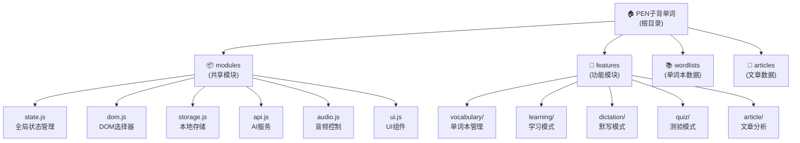

# CLAUDE.md

This file provides guidance to Claude Code (claude.ai/code) when working with code in this repository.

## 变更记录 (Changelog)

### 2025-09-15 23:44:59 - AI上下文优化更新
- ✅ 更新项目结构分析和覆盖率统计
- ✅ 验证现有模块化架构完整性
- ✅ 优化模块结构图和导航体系
- ✅ 确认所有功能模块和共享模块的完整实现

### 2025-09-14 23:20:57 - AI上下文初始化
- ✅ 完成项目AI上下文初始化和模块化文档梳理
- ✅ 识别5个核心功能模块和6个共享模块
- ✅ 生成模块结构图和导航体系
- ✅ 建立完整的AI开发指引文档

## 项目愿景

PEN子背单词是一个现代化的中文背单词学习应用，致力于通过AI技术和现代Web技术提供高效的英语词汇学习体验。应用支持多种学习模式，包括词汇管理、智能学习、默写训练、随堂测验和文章分析，为用户提供全方位的英语学习支持。

## 架构总览

应用采用现代ES6模块化架构，基于纯前端技术栈构建，集成AI服务和TTS语音合成技术。整体架构分为三层：
1. **表示层** - HTML/CSS界面和用户交互
2. **业务层** - 五大功能模块（词汇、学习、默写、测验、文章）
3. **服务层** - 六大共享模块（状态、DOM、存储、API、音频、UI）

## 模块结构图



## 模块索引

| 模块类型 | 模块名称 | 路径 | 职责描述 | 状态 |
|---------|---------|------|---------|------|
| **入口** | 主应用 | `main.js` | 应用启动、导航控制、模块初始化 | ✅ |
| **核心界面** | HTML入口 | `index.html` | 应用主界面，包含5大功能区块 | ✅ |
| **样式** | 主样式 | `styles.css` | 全局样式和响应式布局 | ✅ |
| **共享模块** | 状态管理 | `modules/state.js` | 全局状态定义和管理函数 | ✅ |
| **共享模块** | DOM选择器 | `modules/dom.js` | 统一DOM元素引用 | ✅ |
| **共享模块** | 本地存储 | `modules/storage.js` | localStorage数据持久化 | ✅ |
| **共享模块** | AI服务 | `modules/api.js` | AI API调用和处理 | ✅ |
| **共享模块** | 音频控制 | `modules/audio.js` | Web Audio和TTS语音服务 | ✅ |
| **共享模块** | UI组件 | `modules/ui.js` | 通用UI组件(模态框、步进器等) | ✅ |
| **功能模块** | 单词本管理 | `features/vocabulary/` | 词汇CRUD、导入导出、合并 | ✅ |
| **功能模块** | 学习模式 | `features/learning/` | 单词详情、例句生成、语法检查 | ✅ |
| **功能模块** | 默写模式 | `features/dictation/` | 听写练习、进度跟踪、设置控制 | ✅ |
| **功能模块** | 测验模式 | `features/quiz/` | 选择题生成、计分、结果统计 | ✅ |
| **功能模块** | 文章分析 | `features/article/` | 文章解析、朗读控制、词汇分析 | ✅ |
| **数据层** | 单词本数据 | `wordlists/` | 预置单词本JSON文件(3A/4B/5A全册+各单元) | ✅ |
| **数据层** | 文章数据 | `articles/` | 示例文章JSON文件 | ✅ |
| **配置** | AI配置 | `ai-config.js` | AI服务和TTS配置(需从example复制) | ✅ |

## 运行与开发

### 环境要求
- 现代浏览器（支持ES6模块）
- 本地HTTP服务器（CORS限制）
- AI API密钥配置（可选）

### 快速启动
```bash
# 方式1：Python内置服务器
python3 -m http.server 8000

# 方式2：Node.js http-server
npx http-server

# 访问: http://localhost:8000
```

### 配置文件
- `ai-config.js` - AI服务配置（从example复制并填入API密钥）
- `wordlists/manifest.json` - 可用单词本清单
- `articles/manifest.json` - 可用文章清单

### 数据结构
- **单词本格式**：`{ id, name, words: [{ word, phonetic, meaning }] }`
- **文章格式**：`{ id, title, content, difficulty, keywords }`
- **状态管理**：通过 `modules/state.js` 集中管理应用状态

## 测试策略

### 单元测试覆盖
- ❌ 暂无自动化测试框架
- ✅ 浏览器控制台手动测试
- ✅ localStorage数据验证
- ✅ AI API连接测试

### 功能测试重点
1. **模块化加载** - 确保所有模块正确初始化
2. **状态管理** - 验证状态更新和同步
3. **数据持久化** - localStorage读写操作
4. **跨模块通信** - 导航切换和数据共享
5. **AI集成** - API调用和错误处理
6. **音频功能** - TTS和Web Audio兼容性

### 测试建议
- 为每个功能模块添加单元测试
- 集成端到端测试框架（如Playwright）
- 添加API mock以支持离线测试
- 建立CI/CD流水线验证代码质量

## 编码规范

### 模块结构规范
- 每个功能模块必须导出 `init()` 函数
- 使用ES6 import/export语法
- 模块内部状态通过 `modules/state.js` 管理
- DOM操作通过 `modules/dom.js` 统一访问

### 命名约定
- 文件名：小写+连字符 (`word-analysis.js`)
- 函数名：驼峰命名 (`generateExamples`)
- 常量：大写+下划线 (`API_URL`)
- CSS类：小写+连字符 (`vocab-book-list`)

### 错误处理
- API调用必须包含错误捕获
- 用户操作提供友好提示
- 控制台输出详细错误信息
- 优雅降级（AI服务不可用时）

## AI使用指引

### AI服务集成
应用集成多种AI功能，通过 `modules/api.js` 统一管理：

1. **单词分析** - 获取音标、词性、中文释义
2. **例句生成** - 基于单词生成情境例句
3. **语法检查** - 验证用户输入句子的语法
4. **文章解析** - 分析文章难度和关键词汇

### AI配置管理
```javascript
// ai-config.js 结构
{
  API_URL: "OpenAI兼容接口地址",
  API_KEY: "API密钥",
  AI_MODELS: {
    exampleGeneration: "例句生成模型",
    wordAnalysis: "单词分析模型", 
    sentenceChecking: "语法检查模型"
  },
  TTS_CONFIG: {
    baseUrl: "TTS服务地址",
    apiKey: "TTS API密钥",
    voices: { english: "英语音色", chinese: "中文音色" }
  }
}
```

### 开发时AI使用建议
1. **代码重构** - 优先保持模块边界清晰
2. **功能增强** - 新功能应遵循现有模块化模式
3. **调试协助** - 利用AI分析控制台错误和性能瓶颈
4. **文档生成** - 为新增功能生成对应的模块文档

### 项目特色功能
- **智能导航** - 根据窗口大小自适应导航文本显示
- **音频无障碍** - 支持Web Audio上下文自动解锁
- **渐进增强** - AI服务不可用时仍可使用基本功能
- **数据本地化** - 支持完全离线的词汇管理和练习

---

*此文档由AI助手自动生成和维护，最后更新：2025-09-15 23:44:59*