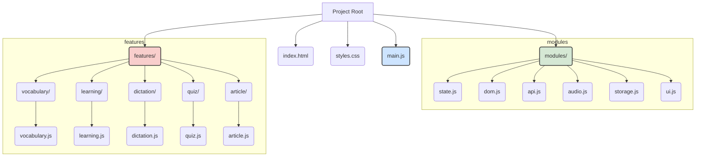

# App.js 重构计划

本文档旨在为 `app.js` 的重构工作提供一个清晰、可执行的路线图。当前应用的所有逻辑都集中在一个超过3000行的文件中，这导致了代码难以维护、扩展和测试。本次重构的目标是将其改造为一个现代的、模块化的前端应用。

---

## 1. 现有问题分析

当前的 `app.js` 实现存在以下核心问题：

*   **全局命名空间污染**: 大量的全局变量用于存储应用状态、DOM 元素引用和各种标志位，这使得状态管理变得混乱且不可预测。
*   **高耦合 (High Coupling)**: 所有功能（单词本、默写、测验、文章分析等）的逻辑紧密地交织在一起。它们共享全局变量，一个巨大的 `setupEventListeners` 函数负责绑定所有事件，导致修改任一功能都可能意外影响其他功能。
*   **低内聚 (Low Cohesion)**: 单个功能的代码（变量、DOM引用、事件处理、业务逻辑）分散在文件的不同部分，而不是组织在一起。这违反了高内聚原则，使得理解和修改特定功能变得非常困难。
*   **缺乏可测试性**: 由于缺乏模块化，无法对单个功能（如测验逻辑）进行独立的单元测试或集成测试。
*   **可维护性与可扩展性差**: 在现有代码库上添加新功能或修复错误，需要开发者对整个庞大的文件有深入的了解，风险高且效率低下。

---

## 2. 重构目标

本次重构旨在达成以下目标：

*   **实现模块化**: 将代码库拆分为多个功能独立、职责单一的 ES6 模块。
*   **分离关注点**: 将数据（状态）、视图（DOM操作）和逻辑（功能实现）清晰地分离开来。
*   **提高可维护性**: 使代码结构清晰，易于理解、修改和调试。
*   **增强可扩展性**: 建立一个可扩展的架构，未来可以轻松地添加新功能，而无需大规模修改现有代码。
*   **提升性能与可靠性**: 通过按需加载和更清晰的数据流，减少潜在的性能瓶頸和 bug。

---

## 3. 新的文件结构规划

我们将采用基于功能和职责的目录结构，以取代单一的 `app.js`。

*   `main.js`: **新的应用入口**。负责初始化所有模块和功能。
*   `modules/`: **核心共享模块**。存放应用范围内的、可复用的底层逻辑。
    *   `state.js`: 集中管理应用的**全局状态**（如单词本数据、当前活动的书籍ID、测验状态等）。
    *   `dom.js`: 存放所有的 **DOM 元素选择器**。
    *   `api.js`: 封装所有与 **AI 后端交互**的 `fetch` 调用。
    *   `audio.js`: 封装 **Web Audio API** 和 **TTS** 相关的逻辑。
    *   `storage.js`: 封装所有 `localStorage` 的**读写操作**。
    *   `ui.js`: 包含通用的 UI 组件逻辑，如**模态框 (Modal)、数字步进器 (Stepper)、提示框 (Tooltip)** 等。
*   `features/`: **业务功能模块**。每个子目录代表一个独立的功能。
    *   `vocabulary/vocabulary.js`: 单词本管理（增删改查、导入导出、合并）。
    *   `learning/learning.js`: 学习模式。
    *   `dictation/dictation.js`: 默写模式。
    *   `quiz/quiz.js`: 测验模式。
    *   `article/article.js`: 文章分析与朗读功能。

---

## 4. 详细的迁移步骤

我们将分三个主要阶段进行迁移，确保每一步都是小步快跑，并且应用在迁移过程中始终可用。

### 阶段一：基础架构搭建 (Infrastructure Setup)

此阶段的目标是建立新的文件结构和模块化基础，为功能迁移做准备。

1.  **创建目录和文件**: 根据上述规划，创建 `modules/` 和 `features/` 目录及其内部的初始 `.js` 文件。
2.  **更新入口**:
    *   创建 `main.js` 文件。
    *   修改 `index.html`，将 `` 替换为 ``。
3.  **迁移核心模块**:
    *   **State**: 将 `app.js` 中所有的全局变量（`vocabularyBooks`, `activeBookId`, `quizInProgress` 等）移动到 `modules/state.js` 中，并使用 `export` 关键字导出。
    *   **DOM**: 将所有 `document.getElementById` 和 `querySelectorAll` 调用移动到 `modules/dom.js` 中，并导出为常量。
    *   **Storage**: 将 `saveVocabularyBooks`, `loadVocabularyBooks`, `saveAppState`, `loadAppState` 等函数移动到 `modules/storage.js`。
    *   **Audio**: 将 `speakText`, `unlockAudioContext`, `stopCurrentAudio` 等音频相关函数移动到 `modules/audio.js`。
    *   **API**: 将所有调用 AI 服务的 `fetch` 函数（如 `getWordAnalysis`, `analyzeParagraph`）重构并移动到 `modules/api.js`。
    *   **UI**: 将 `openModal`, `closeModal`, `setupNumberSteppers` 等通用 UI 函数移动到 `modules/ui.js`。
4.  **初步整合**: 在 `main.js` 中，导入 `storage.js` 的加载函数，并在 `DOMContentLoaded` 事件中调用，以验证基础架构是否能正确加载初始数据。

### 阶段二：功能模块化迁移 (Feature Migration)

此阶段逐一迁移每个独立的功能。对每个功能（例如“默写模式”）重复以下步骤：

1.  **创建功能文件**: 例如，创建 `features/dictation/dictation.js`。
2.  **迁移业务逻辑**:
    *   从 `app.js` 中剪切所有与该功能相关的函数（如 `startDictation`, `stopDictation`, `checkDictation`）并粘贴到新的功能文件中。
3.  **迁移事件监听器**:
    *   在功能文件中创建一个 `init()` 函数，例如 `initDictation()`。
    *   从 `app.js` 的 `setupEventListeners` 函数中，剪切与该功能相关的 `addEventListener` 代码块，并粘贴到 `initDictation()` 函数中。
4.  **解决依赖**:
    *   在 `dictation.js` 文件顶部，使用 `import` 语句从 `modules/` 目录中导入所需的依赖（如 `state`, `dom`, `audio`）。
    *   例如: `import * as state from '../../modules/state.js';`
    *   `import { dictationInput, checkDictationBtn } from '../../modules/dom.js';`
5.  **导出初始化函数**: 从 `dictation.js` 中 `export { initDictation }`。

**迁移顺序建议**:
`Vocabulary` -> `Learning` -> `Dictation` -> `Quiz` -> `Article`。从最基础的功能开始，逐步迁移。

### 阶段三：整合与清理 (Integration & Cleanup)

1.  **整合初始化**:
    *   在 `main.js` 中，从所有 `features/` 文件里导入各自的 `init` 函数。
    *   在 `main.js` 的 `DOMContentLoaded` 监听器中，依次调用每个功能的 `init` 函数（`initVocabulary()`, `initDictation()` 等）。这将完成所有事件的绑定。
2.  **代码清理**:
    *   此时，`app.js` 中的大部分代码应该已经被迁移。仔细检查 `app.js`，移除所有已被迁移的逻辑。
    *   最终，`app.js` 文件可以被安全地删除。
3.  **最终审查**: 全面测试应用的所有功能，确保在新的模块化架构下一切正常工作。

---

## 5. 强调增量方法

本次重构成功的关键在于**增量进行**。在完成每个主要步骤（例如，成功迁移完“默写”功能的所有逻辑和事件后）都应该进行一次完整的测试，以确保该功能以及应用的其他部分没有被破坏。这种方法将风险降至最低，并使调试过程更加简单。