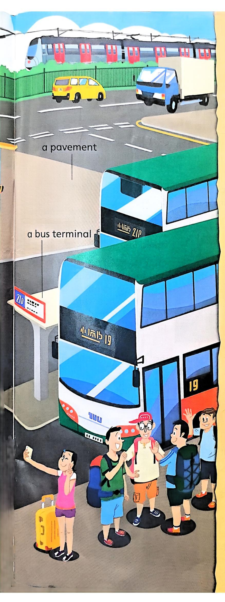
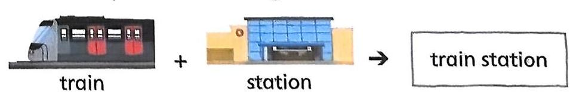
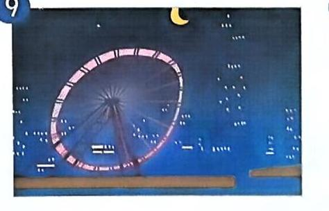
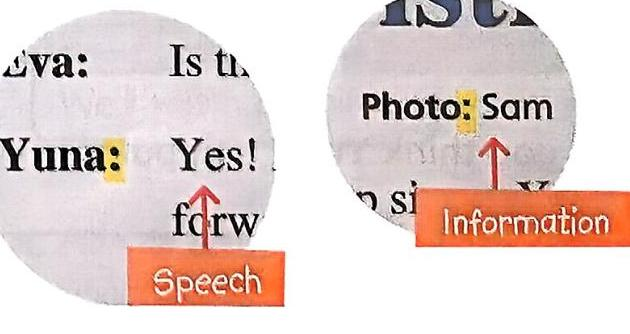

# All around the city 

Ben and his friends are outside the train station. It is a busy place.
Where can they take different types of transport?

# Vocabulary 

a bus terminal

a footbridge

a pedestrian crossing

a taxi rank

traffic lights

a train station

Ben and his friends took part in a city orienteering race. Let's read the story and find out what happened in the race.

# Lost in the city 

Why was the race difficult for the children? Can you guess?

Ben and his friends Betty, Chris and Anna took part in the City Race last Saturday. It was more difficult than they thought!
'The first checkpoint is a hotel in Tsim Sha Tsui,' said Betty. 'That's easy! I know Tsim Sha Tsui very well.'

'How far is it from the train station to the hotel?' asked Ben.

Chris checked the map and said, 'It's about three kilometres. We can go over that footbridge and walk to the hotel.'

Why did Anna want to take a taxi?
'I don't want to walk three kilometres,' Anna shouted. 'Let's take a taxi. We're right next to the taxi rank.'
'We can't take a taxi. It's against the rules! Let's take a bus instead,' said Chris.
'How long does it take to go from the bus terminal to the hotel by bus?' asked Anna.
'It takes about 15 minutes,' answered Chris.

After some discussion, they all agreed to take the bus from the bus terminal near the train station.

The children got off the bus near Kowloon Park.
'The hotel is on Cameron Road,' said Betty. 'It's about 200 metres from here.'
'Great! Let's walk quickly!' said Ben.
The children stopped at a pedestrian crossing.
'Can't we just cross the road?' complained Ben.
'No, we must wait for the green light. Stay on the pavement, Ben,' said Chris.

The children continued walking when the traffic lights turned green. Suddenly, Betty yelled, 'We're on Cameron Road now. 40 Let's look for the hotel.'

They ran up and down the road, but they could not find any hotels.
'Are you sure we're on the right road?' asked Anna.
'No, we're not!' Chris pointed at a street sign. 'This isn't Cameron Road. This is Carnarvon Road.'

They all looked at Betty.
'Well, I guess I don't know
Tsim Sha Tsui very well.'

What made the children stop at the pedestrian crossing? (1)

Who said the last sentence? (2)

What is your favourite way to get around the city?
What type of transport do you use?

# (3) Self-learning skill 

Sometimes we use two words as a single noun. Combine the meanings of the words and guess what the noun means. Can you find more examples in the story?

# 2) A tour in Hong Kong 

Anna is doing a school project about different attractions in Hong Kong. Look at the map. What attractions can you see?

Vide0

# Vocabulary 

Avenue of Stars

Hong Kong Disneyland

Ngong Ping Village

Stanley Market

The Hong Kong Observation Wheel

Golden Bauhinia Square

Hong Kong Wetland Park

Ocean Park

Tai O

The Peak

# Reading 

Anna finds a magazine article about a Korean pop star's coming trip to Hong Kong. What attractions does the pop star want to visit? Let's find out with her.

K-Pop Weekly
5 December

## K-Pop Super Star Yuna in Hong Kong for Christmas Concert

Text: Eva Photo: Sam
Korean pop singer Yuna Kim will come to Hong Kong for the fourth stop of her Christmas concert tour. It will be her first time visiting Hong Kong. During her interview with K-Pop Weekly, Yuna talked about her concert and travel plans.

Eva: Hello, Yuna. Your new CD album Candy Time is a real hit. Congratulations!

Yuna: Thank you, Eva. I'm glad that my fans like the album. I'll sing some of the songs from Candy Time and my favourite Christmas songs at the concert. I'll perform with eight dancers on stage! I hope all my fans will dance with us and have a great time on Christmas Eve.

Eva: Is this your first concert in Hong Kong?
Yuna: Yes! It'll be my first time in Hong Kong too. I'm looking forward to my trip. I have a lot of fans in Hong Kong. They tell me Hong Kong is a beautiful city and there's yummy food everywhere! I'll go and visit some famous attractions such as Ngong Ping Village and Tai O. They seem like very interesting places. I want to take some photos and buy souvenirs.

Yuna's manager is kind enough to share Yuna's itinerary with us. Fans in Hong Kong are welcome to visit these places to meet Yuna 30 and take photos with her.

Yuna's three-day trip in Hong Kong
Day 1 Christmas concert
Day 2 Ngong Ping Village \& Tai O
Day 3 Hong Kong Disneyland

Yuna is greeting the fans at her Taiwan concert.

Yuna is visiting Tai O with her family at Christmas.

Which is your favourite tourist attraction in Hong Kong? Why?

# (2) Reading skill 

Colons can indicate direct speech or introduce information.

# 3) When Grandma was young 

Anna and her family are getting ready for school and work.
What are they doing in the picture?

# Vocabulary 

button my clothes carry my school bag

tie my hair up

eat with chopsticks

have a bath

prepare a meal

put on my shoes

tie my shoelaces

# Reading 

Examples
Anna and Grandma are babysitting Anna's little cousins. Read the conversation to see what happens.

Grandma: Anna, could you please help Oscar button his clothes? My hands are full. I'm preparing a meal for all of you.

Anna: I'm tying June's hair up. Can you ask Oscar to button his clothes by himself?

Grandma: Don't be silly! Oscar is only four years old.

Anna: I could button my own clothes by myself when I was four.

Grandma: That's not true. Jessica helped you with that. You couldn't button your clothes by yourself until you were five.

Anna: Really? I don't remember my sister doing that. What could I do by myself when I was four?

Grandma: Let me see ... when you were four, you could ... comb your hair by yourself.

Anna: But I had very short hair.
Grandma: That's why you could do it by yourself, dear! Hurry up and give Oscar a hand. He's doing the buttons all wrong!
Anna: All right. Come here, Oscar. Let me help you. What else could I do when I was four, Grandma?

Grandma: Oh, you could also put on your own shoes, but you couldn't tie your shoelaces by yourself. It took two more years for you to learn how to do that.

Anna: Tying shoelaces is difficult! Jessica couldn't do it until she was seven.

Grandma: I could tie my shoelaces when I was five. When we were young, we could do a lot of things by ourselves.

Anna: What kinds of things could you do by yourself when you were young?

Grandma: Things like preparing a meal, washing our clothes, or even making our own dresses. When I was young, I made dresses for myself and my sisters. I could also prepare a meal for my family when I was eight. Nowadays, some children can't even eat with chopsticks when they are eight.

Anna: Could you carry your own school bag?
Grandma: I didn't have to carry a school bag. My family was too poor to send me to school! I could not read until I was 30.

What could you do when you were four? Do you remember?

## (3) Reading skill

Find the main idea of a part of a conversation by working out what most of the sentences are about.
main idea the things Grandma could do by herself when she was young

# 4 An offline holiday 

Betty and her family do a lot of things on the Internet. What are they doing in the picture?

# Vocabulary 

check messages join a forum

publish a post post a comment

surf the Internet share a link

download a video

shop online

give a rating

# Reading 

## Examples

Betty's family was on a holiday trip. They spent a night without using the Internet. Let's find out what happened.

## An offline holiday

Betty and her family went to Bangkok for a holiday trip. When they returned to the hotel at night, Betty wanted to surf the Internet.
'Dad, can I please borrow your tablet?' 5 asked Betty.

Dad asked, 'Why do you need it?'

Betty answered, 'I need it because I want to surf the Internet. I want to message my friends and upload some photos too.'

Dad scratched his head and said, 'I'm sorry, Betty. The battery of my tablet ran out and I couldn't find the charger.'

What was there in Mum's hands?

Why couldn't Dad give Betty and Billy his smartphone?

'How about your smartphone? Can we use it instead? I want to download a video and check messages,' Billy heard the conversation and asked.
'The phone battery is low too,' Dad answered.
'Oh, this is the worst holiday ever!' Betty yelled.
'Come on, children,' Mum said. 'There are many other things we can do without a tablet or a smartphone. In the past, my friends and I used to talk all night when we went on trips together.'

'That's right,' Dad said, 'In the past, we also used to play card games with our friends. Nowadays, people usually play games on the Internet.'
'I have some card games in my luggage. I bought them from an online shop last month. Shall we try one of the games?' asked Mum.
'All right. It's better than doing nothing,' Betty and Billy answered.

Mum took out a deck of cards and explained the rules of the game to Betty and Billy, but they had a problem.
'Mum, how do you hold the cards?' asked Betty.
'We never have to hold the cards when we play online card games,' said Billy.

When they returned to Hong Kong, Mum gave the card game a high rating and posted a comment on the shop's website.

30
What problem did Betty and Billy have?

30
What do you usually do in your free time? Do you spend most of your time online or offline?

# (1) Reading skill 

Look at the position of a word and find out if it acts as a noun or a verb in the sentence.
I shop online every month.
A verb follows the subject of a sentence.
I bought them from an online shop ...

A noun can be the subject or object of a sentence.

# 5 A wonderful weekend 

Ben has a toy farm. There are a lot of fun activities on his farm.

# Vocabulary 

feed animals

make candles

pick fruit

play in a tree house

ride a horse

make bread

make soap

play golf

play on a rope course

ride a boat

row a boat

# Reading 

Examples
Ben wants to visit a farm during the weekend. He finds a website of an interesting farm.

## Fantasy Family Farm

## A fabulous farm for a fun-filled family trip

You want to send an email to the farm. In which section can you find their email address?

## HOME I SHOWS I NEWS I PHOTOS I CONTACT US

Are you looking for outdoor fun? Have you ever taken care of plants and animals? Have you ever made food and things which you need in your daily life? You can try all of these at Fantasy Family Farm!

On our farm, you can pick fruit from our apple trees. We get milk from cows and eggs from chickens, 10 but they need food too! Feed our animals and keep them healthy. Learn how to make bread, soap and candles like people did in the past. You can take home anything which you make!

There is time to play too! You can ride a horse in our grassy green fields or row a boat on our beautiful blue lake. If you want to play among the terrific tall trees, we have a tree house and a rope course. If sport is what you want, you can even play golf.

Make plans now to enjoy an exciting educational experience at Fantasy Family Farm!

# Fantasy Family Farm 

A fabulous farm for a fun-filled family trip

HOME I SHOWS I NEWS I PHOTOS I CONTACT US
A very special guest
11 June
Last month, we welcomed our 10,000th visitor! Jenny Leung will get free entry to our farm for the rest of her life! We interviewed her during her visit.

FFF: Welcome to our farm. Have you ever lived on a farm?
JL: No, I've never lived on a farm. I've always lived in the city.

FFF: What activity on our farm do you like most?
JL: I like making candles most.
FFF: Have you ever made anything by hand?
JL: I've made bread before, but I've never made soap or candles. It's interesting!

FFF: Have you ever played with a farm animal?
JL: Yes, I've ridden a horse before.
FFF: Nice! I have an interesting question. What do you call a horse which lives next to you?

JL: Hmm, a 'neigh-bour'!
FFF: You're so clever!

## (3) Reading skill

We often put words which start with the same letter close together to catch readers' attention. This is called 'alliteration'.

# Ame Aunr was away 

Karen is spending the weekend at her uncle and aunt's home. She is busy doing housework with her uncle and cousins. What are they doing?

## Vocabulary

cook a meal

hang the washing

order a takeaway

take the rubbish out

vacuum the rug

do the grocery shopping

iron the clothes

put the toys away

tidy up the bedroom

walk the dog

Karen's aunt was on a business trip. What happened to Karen, her uncle and her cousins? Read and find out.

This morning, Karen's uncle told her cousins, 'Your mum will come back home tomorrow. There's a lot of housework to do before she gets home. Can you help? I've made a list.'

Things to do

- do the grocery shopping
- vacuum the rug
- walk the dog
- wash the clothes 10
- hang the washing
- wash the dishes
'Can I help too?' asked Karen. 'Sure! Karen, which would you like to do, vacuum the rug or wash the dishes?' asked her cousin Ray. 'I'd like to wash the dishes,' replied Karen. 'OK. Let me vacuum the rug,' said Ray.

Why did Karen's uncle tell her to be careful?

Karen was washing the dishes in the kitchen. Clack! Clack! 'Be careful!' said Karen's uncle. 'Don't break the dishes.'

Ray vacuumed the rug in the sitting room. Crash! He hit the bookcase and all the books fell onto the floor. Karen and her uncle helped him put the books back on the shelves.

Karen's other cousin Eva started to wash the clothes, but she put in too much washing powder and a lot of bubbles came out of the washing machine! Ray and his father helped her clean the floor.

In the afternoon, they were still busy. Karen asked, 'I've already 30 hung the washing. What should I do now, Uncle?' Her uncle replied, 'Have you and Eva walked the dog yet?' Karen replied, 'No, we haven't walked Bobo yet. I've just fed him.
Eva has just done the grocery shopping.

It was seven o'clock in the evening. 'Oops! There's no water supply and I can't cook the meal. Let's order a takeaway. Which would you like to have for dinner, pizza or chicken wings?' asked Karen's uncle. 'I'd like to have pizza!' replied Ray. 40 Suddenly, someone opened the door. 'Surprise! I missed you all, so I came home one day earlier. Have you had dinner yet? I've just bought a big pizza and some pasta for you!' said Karen's 45 aunt. 'We missed you too!' Karen and her cousins shouted happily.

How do you help at home? How often do you do these things?

# Reading skill 

Some words sound like the noises they describe. These sound words make a story more lively and interesting.

Clack!

Crash!

Boom!

Splash!

Meow!

Find more sound words and share with your classmates.